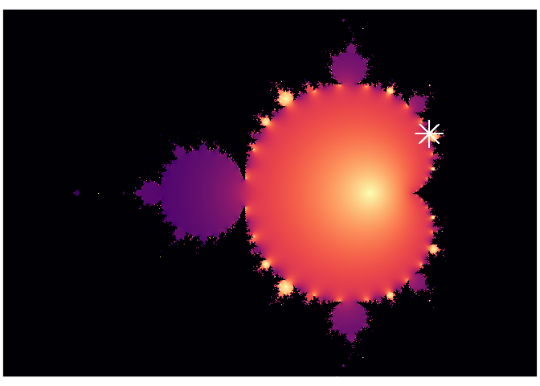

# Julia-and-Mandelbrot-set-plots-in-R
 Simple Julia and Mandelbrot set plots using ggplot:
 
## Julia set plot (here, a plot for C = 0.355+0.355i)

## Mandelbrot set plot (with marking for Julia C value)

